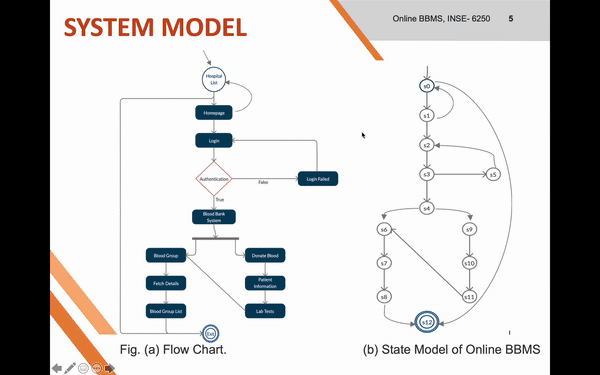

# Modeling-and-Verification-of-Online-Blood-Bank-Management-System

This paper proposes a model checking and verification approach for an Online Blood Bank Management System. The Blood Bank has been modeled in the form of the page navigation system and atomic proposition transitions. To represent the behavior of the system, we use the Kripke structure and to simulate the sequential logic and computation of the model we use Finite State Machine (FSM). Further to identify the correctness of the model, we use formal language specifications such as Linear Temporal Logic (LTL) and Computation Tree Logic (CTL). The complete automation for checking and verification of the model can be done using the NuSMV (New Symbolic Model Verifier) tool.

Keywords: Online Blood Bank Management System, Kripke Structure, Linear Temporal Logic, Computation Tree Logic, NuSMV.

Checkout the project's medium post for interesting details in brief here- https://medium.com/@faizan.kletech/modeling-and-verification-using-nusmv-5c7ac815819c
Demo:

Download NuSMV tool accrording to Operating System Requirements, along with other necessary tools and packages such as Git, Java, etc., or watch NuSMV tool installation on Youtube.

After installation do this:
Steps for Verification
After installation of the NuSMV model checker and other system specific requirements (BDD-based, SAT-based, etc), we write the SMV code specifying states and transitions of the
Online Blood Bank Management System we specify the logic behind the code and run the following commands:
1. Open the terminal, go to NuSMV folder, navigate to source code file, and run ‘terminal>path> NuSMV -i’
2. NuSMV > read_model -i filename (bloodbank.smv)
3. NuSMV > flatten_hierarchy
4. NuSMV > encode_variables
5. NuSMV > build_model
6. NuSMV > check_ctlspec “property” (to check the CTL specifications of Table 1&2)
7. NuSMV > check_ltlspec “property” (to check the CTL specifications of Table 3 only)
Optional,
8. NuSMV > show_vars (to print all states of the model)
9. NuSMV > print_bdd_stats (to print BDD related details of the model)
